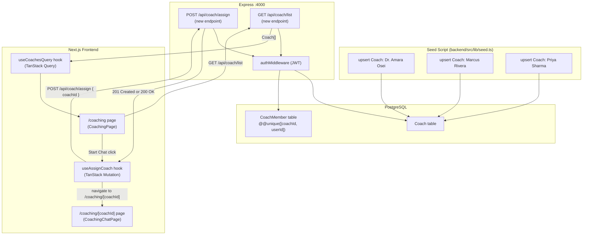
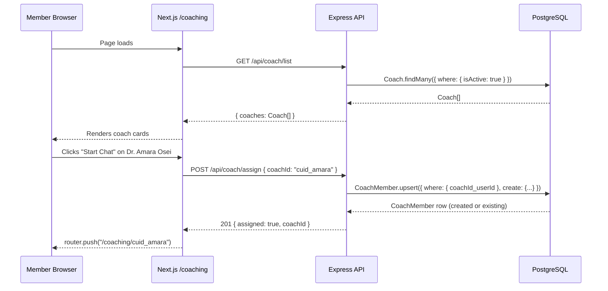
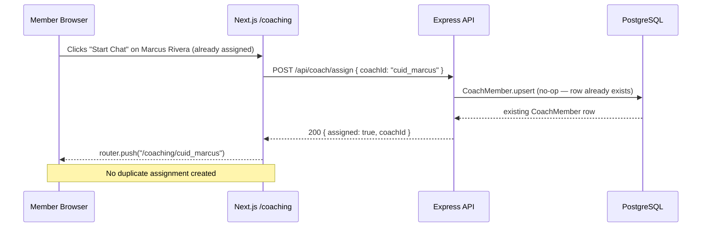
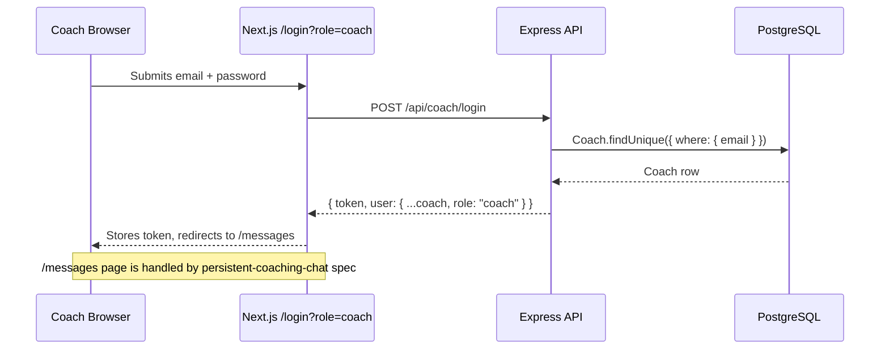

# Design Document: Coach Seeding & Member-to-Coach Chat Assignment

## Overview

This feature has two tightly coupled responsibilities. First, it seeds the three real coach profiles from the Azadi Health HTML prototype into the PostgreSQL database using idempotent upserts, replacing the single placeholder `coach@test.com` record. Second, it introduces the member-side "connect to a coach" flow: when a member clicks **Start Chat** on the `/coaching` page, the system creates a `CoachMember` assignment row (if one does not already exist) and then navigates to the `/coaching/[coachId]` chat page. The assignment row is the prerequisite that the existing `persistent-coaching-chat` spec's Assignment Guard checks before allowing any message to be saved.

This spec deliberately does **not** re-implement the messaging layer (Socket.IO, `CoachMessage` persistence, `useCoachMessages`, `useCoachSocket`, the coach `/messages` inbox). All of that is covered by the `persistent-coaching-chat` spec. This spec only covers the seeding pipeline and the assignment creation path that feeds into it.

---

## Architecture



---

## Sequence Diagrams

### Member Connects to a Coach for the First Time



### Member Reconnects to an Already-Assigned Coach



### Coach Logs In and Views Inbox



---

## Components and Interfaces

### Component 1: Seed Script (`backend/src/lib/seed.ts`)

**Purpose**: Idempotently populate the `Coach` table with the three real Azadi Health coaches. Re-running the script must never create duplicate rows.

**Interface**:
```typescript
// No exported interface — runs as a top-level script via `ts-node`
// Internally calls prisma.coach.upsert for each coach record
```

**Coach records to seed**:

| Field       | Dr. Amara Osei              | Marcus Rivera               | Priya Sharma                    |
|-------------|-----------------------------|-----------------------------|----------------------------------|
| `email`     | amara@azadihealth.com       | marcus@azadihealth.com      | priya@azadihealth.com            |
| `name`      | Dr. Amara Osei              | Marcus Rivera               | Priya Sharma                     |
| `password`  | bcrypt("coach1234")         | bcrypt("coach1234")         | bcrypt("coach1234")              |
| `avatar`    | `"👩🏾‍⚕️"`                    | `"🧑🏽‍⚕️"`                    | `"👩🏽‍⚕️"`                          |
| `bio`       | "Azadi Health Staff"        | "Azadi Health Staff"        | "University Partners"            |
| `speciality`| "Trauma · CBT · Cultural Identity" | "Depression · Grief · Mindfulness" | "Anxiety · ACT · South Asian Youth" |
| `isActive`  | `true`                      | `true`                      | `true`                           |

**Responsibilities**:
- Use `prisma.coach.upsert` keyed on `email` so re-runs are safe
- Hash passwords with the same `hashPassword` utility already used in the seed file
- Log each upserted coach name on success
- Preserve the existing test user, community groups, and message seed data

---

### Component 2: `GET /api/coach/list` Endpoint

**Purpose**: Return all active coaches so the `/coaching` page can render real DB records instead of mock data.

**Interface**:
```typescript
// Response body
interface CoachListResponse {
  coaches: CoachPublicDTO[];
}

interface CoachPublicDTO {
  id: string;          // Prisma CUID — used as the route param in /coaching/[coachId]
  name: string;
  email: string;
  avatar: string | null;   // emoji string stored in the avatar field
  bio: string | null;      // org affiliation
  speciality: string | null;
  isActive: boolean;
}
```

**Responsibilities**:
- Query `Coach.findMany({ where: { isActive: true }, orderBy: { name: "asc" } })`
- Strip the `password` field before returning
- No authentication required — coaches are public profiles

---

### Component 3: `POST /api/coach/assign` Endpoint

**Purpose**: Create a `CoachMember` assignment row for the authenticated member and the requested coach. Idempotent — calling it twice for the same pair is safe.

**Interface**:
```typescript
// Request body
interface AssignCoachRequest {
  coachId: string;  // Prisma CUID of the target coach
}

// Response body (201 on first assignment, 200 on subsequent calls)
interface AssignCoachResponse {
  assigned: boolean;
  coachId: string;
  assignedAt: string;  // ISO 8601
}
```

**Responsibilities**:
- Require `authMiddleware` — only authenticated members can call this
- Validate that `coachId` is a non-empty string
- Verify the coach exists and `isActive === true`; return 404 if not
- Use `prisma.coachMember.upsert` keyed on `@@unique([coachId, userId])` to avoid duplicates
- Return 201 on creation, 200 if the row already existed

---

### Component 4: `useAssignCoach` Frontend Hook

**Purpose**: TanStack Mutation hook that calls `POST /api/coach/assign` and navigates to the chat page on success.

**Interface**:
```typescript
interface UseAssignCoachOptions {
  onError?: (error: Error) => void;
}

function useAssignCoach(options?: UseAssignCoachOptions): {
  assignAndNavigate: (coachId: string) => void;
  isPending: boolean;
}
```

**Responsibilities**:
- Call `POST /api/coach/assign` with `{ coachId }`
- On success, call `router.push("/coaching/" + coachId)`
- On error, invoke `options.onError` or show a toast
- Expose `isPending` so the button can show a loading state

---

### Component 5: Updated `CoachingPage` (`/coaching`)

**Purpose**: Replace the mock `useCoachesQuery` data source with real DB coaches, and wire the "Start Chat" button through `useAssignCoach`.

**Interface**: No new props — this is an internal page component change.

**Responsibilities**:
- `useCoachesQuery` already calls `GET /api/coach/list` (or will be updated to do so)
- Replace `onMessage={() => router.push(...)}` with `onMessage={() => assignAndNavigate(c.id)}`
- Show a spinner on the card while `isPending` for that coach's assignment

---

## Data Models

### `Coach` (existing — no schema changes needed)

```typescript
interface Coach {
  id: string;           // CUID primary key
  email: string;        // unique
  name: string;
  password: string;     // bcrypt hash — never returned to clients
  avatar: string | null;
  bio: string | null;
  speciality: string | null;
  isActive: boolean;    // default true
  createdAt: DateTime;
  updatedAt: DateTime;
}
```

**Validation Rules**:
- `email` must be unique across all coaches
- `password` must be stored as a bcrypt hash, never plaintext
- `isActive` defaults to `true`; inactive coaches are excluded from `GET /api/coach/list`

---

### `CoachMember` (existing — no schema changes needed)

```typescript
interface CoachMember {
  id: string;           // CUID primary key
  coachId: string;      // FK → Coach
  userId: string;       // FK → User (member)
  assignedAt: DateTime; // default now()
}
// @@unique([coachId, userId]) — enforced at DB level
```

**Validation Rules**:
- The `@@unique([coachId, userId])` constraint prevents duplicate assignments
- Both `coachId` and `userId` must reference existing rows (FK constraints with cascade delete)
- `assignedAt` is set once at creation and never updated

---

## Algorithmic Pseudocode

### Seed Algorithm

```pascal
ALGORITHM seedCoaches()
INPUT: none
OUTPUT: void (side effects: upserts 3 Coach rows)

BEGIN
  coaches ← [
    { email: "amara@azadihealth.com",  name: "Dr. Amara Osei",  speciality: "Trauma · CBT · Cultural Identity",      bio: "Azadi Health Staff",  avatar: "👩🏾‍⚕️" },
    { email: "marcus@azadihealth.com", name: "Marcus Rivera",   speciality: "Depression · Grief · Mindfulness",       bio: "Azadi Health Staff",  avatar: "🧑🏽‍⚕️" },
    { email: "priya@azadihealth.com",  name: "Priya Sharma",    speciality: "Anxiety · ACT · South Asian Youth",      bio: "University Partners", avatar: "👩🏽‍⚕️" }
  ]

  hashedPassword ← hashPassword("coach1234")

  FOR each coach IN coaches DO
    prisma.coach.upsert({
      where:  { email: coach.email },
      update: { name: coach.name, speciality: coach.speciality, bio: coach.bio, avatar: coach.avatar, isActive: true },
      create: { ...coach, password: hashedPassword, isActive: true }
    })
    LOG "Seeded coach: " + coach.name
  END FOR
END
```

**Preconditions**:
- `prisma` client is connected to a running PostgreSQL instance
- `hashPassword` utility is available and returns a bcrypt hash
- The `Coach` table exists (migrations have been run)

**Postconditions**:
- Exactly 3 `Coach` rows exist for the three emails (no duplicates)
- Each row has `isActive = true` and a valid bcrypt password hash
- Re-running the algorithm produces the same state (idempotent)

---

### Assign Coach Algorithm

```pascal
ALGORITHM assignCoach(userId, coachId)
INPUT:  userId  — authenticated member's CUID
        coachId — target coach's CUID from request body
OUTPUT: { assigned: boolean, coachId: string, assignedAt: string }

BEGIN
  IF coachId IS NULL OR coachId IS EMPTY THEN
    RETURN HTTP 400 { message: "coachId is required" }
  END IF

  coach ← prisma.coach.findUnique({ where: { id: coachId } })

  IF coach IS NULL THEN
    RETURN HTTP 404 { message: "Coach not found" }
  END IF

  IF coach.isActive = false THEN
    RETURN HTTP 404 { message: "Coach not found" }
  END IF

  result ← prisma.coachMember.upsert({
    where:  { coachId_userId: { coachId, userId } },
    update: {},   // no-op if row already exists
    create: { coachId, userId }
  })

  IF result was newly created THEN
    RETURN HTTP 201 { assigned: true, coachId, assignedAt: result.assignedAt }
  ELSE
    RETURN HTTP 200 { assigned: true, coachId, assignedAt: result.assignedAt }
  END IF
END
```

**Preconditions**:
- `userId` is extracted from a valid JWT by `authMiddleware`
- `coachId` is provided in the request body

**Postconditions**:
- Exactly one `CoachMember` row exists for the `(coachId, userId)` pair
- The Assignment Guard in `persistent-coaching-chat` will now pass for this pair
- Calling the algorithm again for the same pair returns 200 with the original `assignedAt`

**Loop Invariants**: N/A (no loops)

---

### useAssignCoach Hook Algorithm

```pascal
ALGORITHM assignAndNavigate(coachId)
INPUT:  coachId — string CUID of the selected coach
OUTPUT: void (side effects: API call + navigation)

BEGIN
  SET isPending ← true

  TRY
    response ← POST /api/coach/assign { coachId }
    router.push("/coaching/" + coachId)
  CATCH error
    IF options.onError IS DEFINED THEN
      CALL options.onError(error)
    ELSE
      toast.error("Could not connect to coach. Please try again.")
    END IF
  FINALLY
    SET isPending ← false
  END TRY
END
```

**Preconditions**:
- User is authenticated (JWT in localStorage)
- `coachId` is a non-empty string

**Postconditions**:
- On success: browser navigates to `/coaching/[coachId]`
- On failure: error is surfaced to the user; no navigation occurs
- `isPending` returns to `false` in all cases

---

## Key Functions with Formal Specifications

### `seedCoaches(): Promise<void>`

**Preconditions**:
- Database connection is active
- `Coach` table exists

**Postconditions**:
- `∀ email ∈ { "amara@azadihealth.com", "marcus@azadihealth.com", "priya@azadihealth.com" }`: exactly one `Coach` row with that email exists
- All seeded coaches have `isActive = true`
- No existing `Coach`, `User`, `CommunityGroup`, or `Message` rows are deleted

---

### `assignCoachHandler(req, res): Promise<Response>`

**Preconditions**:
- `req.user.id` is set by `authMiddleware` (valid JWT)
- `req.body.coachId` is a non-empty string

**Postconditions**:
- `CoachMember` table contains exactly one row with `(coachId, userId)` matching the request
- Response status is 201 if the row was created, 200 if it already existed
- Response body matches `AssignCoachResponse` shape

---

### `listCoachesHandler(req, res): Promise<Response>`

**Preconditions**:
- Database connection is active

**Postconditions**:
- Response contains all `Coach` rows where `isActive = true`
- No `password` field is present in any returned coach object
- Response status is 200

---

## Example Usage

### Running the Seed

```bash
# From the backend directory
npx ts-node src/lib/seed.ts

# Expected output:
# Seeded coach: Dr. Amara Osei
# Seeded coach: Marcus Rivera
# Seeded coach: Priya Sharma
# Seed completed successfully
```

### Calling the Assign Endpoint (first time)

```typescript
// POST /api/coach/assign
// Authorization: Bearer <member_jwt>
const response = await api.post("/api/coach/assign", { coachId: "clxyz123" });
// HTTP 201
// { assigned: true, coachId: "clxyz123", assignedAt: "2025-01-15T10:30:00.000Z" }
```

### Calling the Assign Endpoint (idempotent re-call)

```typescript
// POST /api/coach/assign (same coachId, same member)
const response = await api.post("/api/coach/assign", { coachId: "clxyz123" });
// HTTP 200 — no duplicate row created
// { assigned: true, coachId: "clxyz123", assignedAt: "2025-01-15T10:30:00.000Z" }
```

### Frontend: Start Chat Button

```typescript
// In CoachingPage
const { assignAndNavigate, isPending } = useAssignCoach({
  onError: (e) => toast.error(e.message),
});

<CoachCard
  coach={c}
  onMessage={() => assignAndNavigate(c.id)}
  disabled={isPending}
/>
```

---

## Correctness Properties

*A property is a characteristic or behavior that should hold true across all valid executions of a system — essentially, a formal statement about what the system should do. Properties serve as the bridge between human-readable specifications and machine-verifiable correctness guarantees.*

### Property 1: Idempotency of seed

*For any* number of Seed_Script executions N ≥ 1, the count of `Coach` rows with emails in `{ amara@azadihealth.com, marcus@azadihealth.com, priya@azadihealth.com }` is always exactly 3 — no more, no fewer.

**Validates: Requirements 1.4**

### Property 2: Seed password hashing

*For any* `Coach` row created by the Seed_Script, the stored `password` field is a valid bcrypt hash (begins with `$2b$` or `$2a$`) and is not equal to the plaintext string `"coach1234"`.

**Validates: Requirements 1.5**

### Property 3: Seed non-destructive

*For any* pre-existing set of `User`, `CommunityGroup`, `Message`, and `CoachMessage` rows present before the Seed_Script runs, those rows are unchanged (same count and same field values) after the Seed_Script completes.

**Validates: Requirements 1.6**

### Property 4: List endpoint active-only filter

*For any* set of `Coach` rows in the database (with arbitrary mix of `isActive = true` and `isActive = false`), the response from `GET /api/coach/list` contains only coaches where `isActive = true`.

**Validates: Requirements 2.2**

### Property 5: List endpoint ordering

*For any* set of active `Coach` rows in the database, the `coaches` array returned by `GET /api/coach/list` is sorted in ascending alphabetical order by `name`.

**Validates: Requirements 2.3**

### Property 6: No password leakage

*For any* `Coach` row in the database, neither `GET /api/coach/list` nor the response body of `POST /api/coach/assign` includes a `password` field in any returned coach object.

**Validates: Requirements 2.4**

### Property 7: Idempotency of assignment

*For any* valid `(coachId, userId)` pair, calling `POST /api/coach/assign` N times (N ≥ 1) results in exactly one `CoachMember` row for that pair in the database.

**Validates: Requirements 3.2**

### Property 8: Assignment enables messaging

*For any* `(coachId, userId)` pair for which `POST /api/coach/assign` has returned a success response, `CoachMember.findFirst({ where: { coachId, userId } })` returns a non-null row — meaning the Assignment_Guard in `persistent-coaching-chat` will pass for that pair.

**Validates: Requirements 3.7**

---

## Error Handling

### Error Scenario 1: Coach Not Found

**Condition**: `POST /api/coach/assign` is called with a `coachId` that does not exist in the `Coach` table, or the coach has `isActive = false`.
**Response**: HTTP 404 `{ message: "Coach not found" }`
**Recovery**: Frontend shows a toast; no navigation occurs.

### Error Scenario 2: Missing `coachId` in Request Body

**Condition**: `POST /api/coach/assign` is called without a `coachId` field.
**Response**: HTTP 400 `{ message: "coachId is required" }`
**Recovery**: Frontend shows a toast; no navigation occurs.

### Error Scenario 3: Unauthenticated Assignment Attempt

**Condition**: `POST /api/coach/assign` is called without a valid JWT.
**Response**: HTTP 401 from `authMiddleware` (existing behaviour)
**Recovery**: Frontend redirects to `/login`.

### Error Scenario 4: Database Error During Upsert

**Condition**: `prisma.coachMember.upsert` throws an unexpected error (e.g., DB connection lost).
**Response**: HTTP 500 `{ message: "Internal server error" }`
**Recovery**: Frontend shows a toast; no navigation occurs.

### Error Scenario 5: Seed Script Failure

**Condition**: The seed script encounters a DB error mid-run.
**Response**: Script logs the error and exits with code 1 (existing `runSeed().catch(...)` pattern).
**Recovery**: Fix the underlying issue and re-run; the upsert pattern ensures partial runs are safe to retry.

---

## Testing Strategy

### Unit Testing Approach

- Test `assignCoachHandler` in isolation using the existing Prisma mock (`backend/src/__mocks__/prisma.ts`):
  - Returns 201 when `upsert` creates a new row
  - Returns 200 when `upsert` finds an existing row
  - Returns 404 when the coach does not exist or is inactive
  - Returns 400 when `coachId` is missing
- Test `listCoachesHandler`:
  - Returns only `isActive: true` coaches
  - Never includes `password` in the response

### Property-Based Testing Approach

**Property Test Library**: `fast-check` (already used in `coachMessage.pbt.test.ts`)

**Properties to test**:

1. **Assignment idempotency**: For any valid `(coachId, userId)` pair, calling the assign handler N times (N ∈ [1, 20]) always results in exactly one `CoachMember` row.

2. **Seed idempotency**: For any number of seed runs ≥ 1, the three target coach emails each appear exactly once in the `Coach` table.

3. **No password in list response**: For any `Coach[]` returned by `listCoachesHandler`, no object in the array has a `password` property.

### Integration Testing Approach

- End-to-end flow: seed → list coaches → assign → verify `CoachMember` row exists → send a message (verifying the Assignment Guard passes)
- Verify that the existing `persistent-coaching-chat` socket tests still pass after the assignment row is created by this feature

---

## Security Considerations

- `POST /api/coach/assign` is protected by `authMiddleware` — only authenticated members can create assignments. Coaches cannot assign themselves to members via this endpoint.
- The `password` field is excluded from all public-facing coach responses (`GET /api/coach/list`, `POST /api/coach/assign` response).
- Dummy seed credentials (`coach1234`) are intentionally weak and suitable only for development/staging. Production deployments must rotate these passwords before going live.
- The `@@unique([coachId, userId])` constraint at the database level provides a second line of defence against duplicate assignments even if the application-level upsert logic has a race condition.

---

## Dependencies

- **Existing**: `prisma`, `@prisma/client`, `bcryptjs` (via `hashPassword` in `auth.service.ts`), `jsonwebtoken` (via `authMiddleware`), `express`
- **Existing frontend**: `@tanstack/react-query`, `axios` (via `api` client), `next/navigation`, `sonner` (toasts)
- **No new dependencies required** — this feature is implemented entirely with existing packages
- **References**: `.kiro/specs/persistent-coaching-chat/` — the Assignment Guard, `CoachMember` model, and coach `/messages` inbox are all defined there and must be implemented first (or in parallel) for the full flow to work end-to-end
