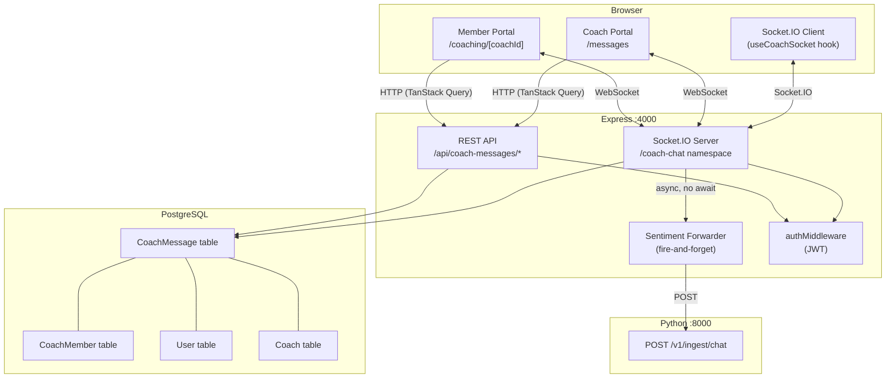
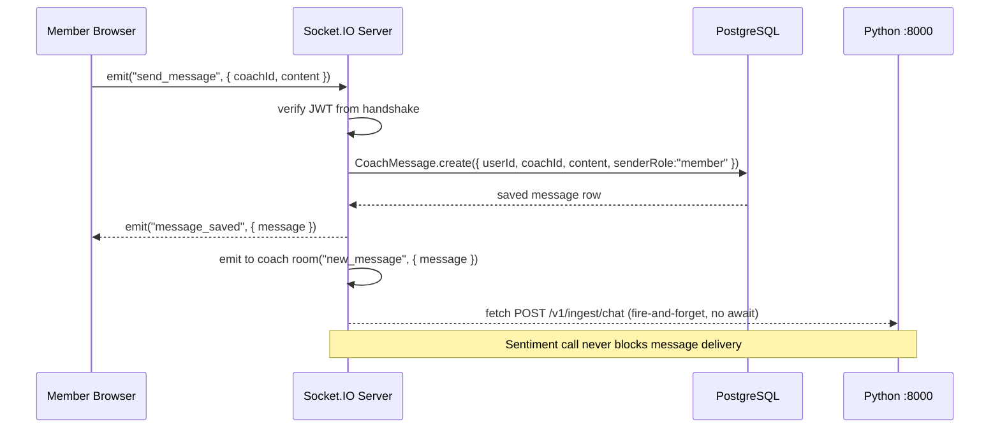
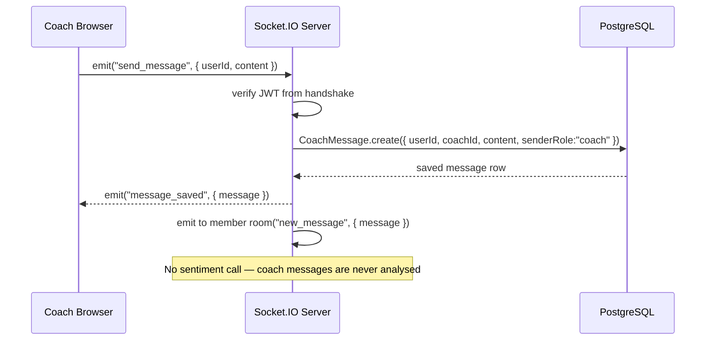
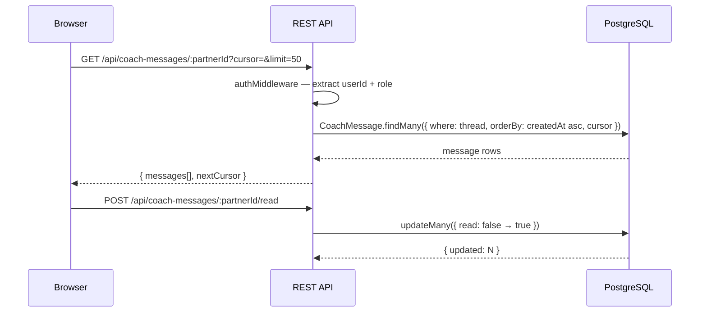

# Design Document: Persistent Coaching Chat

## Overview

This feature replaces the existing mock-data messaging system with a fully persistent, real-time member↔coach messaging system backed by PostgreSQL. Each member–coach pair shares exactly one conversation thread that survives session boundaries. Every message a member sends is asynchronously forwarded to the Python sentiment/risk pipeline at `POST /v1/ingest/chat` — coach messages are never analysed. Real-time delivery is handled by a WebSocket server (Socket.IO) mounted on the existing Express process, so no new infrastructure is required.

The design touches three layers: (1) a new `CoachMessage` Prisma model replacing the User↔User `Message` model for coach conversations, (2) new Express REST + WebSocket endpoints, and (3) updated Next.js pages that swap mock state for TanStack Query + Socket.IO client.

---

## Architecture



---

## Sequence Diagrams

### Member Sends a Message



### Coach Sends a Message



### Initial Page Load (Conversation History)



---

## Components and Interfaces

### Component 1: CoachMessageService (backend)

**Purpose**: Encapsulates all database operations for coach messages. Keeps controllers thin.

**Interface**:
```typescript
interface CoachMessageService {
  getThread(userId: string, coachId: string, cursor?: string, limit?: number): Promise<ThreadPage>
  saveMessage(data: CreateMessageDTO): Promise<CoachMessage>
  markRead(readerUserId: string, readerRole: "member" | "coach", partnerId: string): Promise<number>
  getConversationList(id: string, role: "member" | "coach"): Promise<ConversationSummary[]>
}

interface CreateMessageDTO {
  userId: string       // always the User (member) id
  coachId: string      // always the Coach id
  content: string
  senderRole: "member" | "coach"
}

interface ThreadPage {
  messages: CoachMessage[]
  nextCursor: string | null
}

interface ConversationSummary {
  partnerId: string
  partnerName: string
  partnerAvatar: string | null
  lastMessage: string
  lastMessageAt: Date
  unreadCount: number
}
```

**Responsibilities**:
- Cursor-based pagination (by `createdAt` + `id`) for message history
- Atomic read-receipt updates via `updateMany`
- Conversation list aggregation with unread counts

---

### Component 2: SentimentForwarder (backend)

**Purpose**: Fire-and-forget HTTP call to the Python backend. Never throws or awaits in the message path.

**Interface**:
```typescript
interface SentimentForwarder {
  enqueue(payload: ChatIngestPayload): void   // synchronous — spawns a Promise internally
}

interface ChatIngestPayload {
  event_id: string        // uuid v4
  org_id: string          // from env: PYTHON_ORG_ID
  member_token: string    // User.id (used as stable member token)
  session_id: string      // "{userId}_{coachId}" — stable per thread
  role: "member"          // always "member" — coach messages never forwarded
  text: string
  timestamp: string       // ISO 8601
  consent_active: boolean // true — consent assumed for platform users
}
```

**Responsibilities**:
- Build the `ChatIngestPayload` from a saved `CoachMessage`
- POST to `PYTHON_BACKEND_URL/v1/ingest/chat` with a 5-second timeout
- Log errors to console; never propagate to caller

---

### Component 3: Socket.IO Server (backend)

**Purpose**: Real-time bidirectional messaging over the `/coach-chat` namespace.

**Interface** (Socket.IO events):
```typescript
// Client → Server
interface ClientToServerEvents {
  send_message: (data: { partnerId: string; content: string }) => void
  join_thread:  (data: { partnerId: string }) => void
  mark_read:    (data: { partnerId: string }) => void
}

// Server → Client
interface ServerToClientEvents {
  message_saved: (message: CoachMessageDTO) => void
  new_message:   (message: CoachMessageDTO) => void
  read_receipt:  (data: { partnerId: string; readAt: string }) => void
  error:         (data: { code: string; message: string }) => void
}
```

**Responsibilities**:
- Authenticate via JWT passed in `socket.handshake.auth.token`
- Place each socket in a personal room: `user:{id}` or `coach:{id}`
- On `send_message`: persist via `CoachMessageService`, emit `message_saved` to sender, emit `new_message` to partner's room
- On `mark_read`: update DB, emit `read_receipt` to partner

---

### Component 4: useCoachSocket (frontend hook)

**Purpose**: Manages the Socket.IO connection lifecycle and exposes a stable send function and incoming message stream.

**Interface**:
```typescript
interface UseCoachSocketReturn {
  sendMessage: (partnerId: string, content: string) => void
  isConnected: boolean
}

// Usage
const { sendMessage, isConnected } = useCoachSocket({
  onNewMessage: (msg: CoachMessageDTO) => void,
  onReadReceipt: (data: { partnerId: string; readAt: string }) => void,
})
```

**Responsibilities**:
- Connect on mount, disconnect on unmount
- Attach JWT from `localStorage.getItem("vasl_token")` to handshake
- Reconnect automatically (Socket.IO default backoff)
- Expose `sendMessage` that emits `send_message` event

---

### Component 5: useCoachMessages (frontend hook)

**Purpose**: TanStack Query wrapper for REST history fetch + infinite scroll.

**Interface**:
```typescript
interface UseCoachMessagesReturn {
  messages: CoachMessageDTO[]
  fetchNextPage: () => void
  hasNextPage: boolean
  isFetchingNextPage: boolean
  isLoading: boolean
}

function useCoachMessages(partnerId: string): UseCoachMessagesReturn
```

**Responsibilities**:
- `useInfiniteQuery` against `GET /api/coach-messages/:partnerId`
- Prepend new socket messages to the local cache via `queryClient.setQueryData`
- Trigger `POST /api/coach-messages/:partnerId/read` on mount and when tab gains focus

---

## Data Models

### CoachMessage (new Prisma model)

```prisma
model CoachMessage {
  id         String   @id @default(cuid())
  userId     String                          // FK → User (member)
  coachId    String                          // FK → Coach
  content    String
  senderRole String                          // "member" | "coach"
  read       Boolean  @default(false)
  createdAt  DateTime @default(now())
  updatedAt  DateTime @updatedAt

  user       User     @relation("CoachMessages", fields: [userId], references: [id], onDelete: Cascade)
  coach      Coach    @relation("CoachMessages", fields: [coachId], references: [id], onDelete: Cascade)

  @@index([userId, coachId, createdAt])      // thread fetch + cursor pagination
  @@index([coachId, read])                   // unread count for coach sidebar
  @@index([userId, read])                    // unread count for member sidebar
}
```

**Validation Rules**:
- `content` must be non-empty, max 2000 characters
- `senderRole` must be `"member"` or `"coach"`
- `(userId, coachId)` pair must exist in `CoachMember` table (enforced at service layer)

### CoachMessageDTO (API response shape)

```typescript
interface CoachMessageDTO {
  id: string
  userId: string
  coachId: string
  content: string
  senderRole: "member" | "coach"
  read: boolean
  createdAt: string   // ISO 8601
}
```

### Existing models — changes required

The existing `Message` model (User↔User) is **not deleted** — it may be used elsewhere. The `User` and `Coach` models each gain a `coachMessages` relation field pointing to `CoachMessage`.

```prisma
// Add to User model
coachMessages  CoachMessage[]  @relation("CoachMessages")

// Add to Coach model
coachMessages  CoachMessage[]  @relation("CoachMessages")
```

---

## Algorithmic Pseudocode

### Main Message Send Algorithm (Socket.IO handler)

```pascal
ALGORITHM handleSendMessage(socket, data)
INPUT:  socket (authenticated, has socket.data.user: { id, role })
        data   { partnerId: string, content: string }
OUTPUT: emits events to sender and partner rooms

BEGIN
  ASSERT socket.data.user IS NOT NULL
  ASSERT data.content IS NOT EMPTY AND LENGTH(data.content) <= 2000

  // Resolve userId and coachId regardless of who is sending
  IF socket.data.user.role = "member" THEN
    userId  ← socket.data.user.id
    coachId ← data.partnerId
  ELSE
    userId  ← data.partnerId
    coachId ← socket.data.user.id
  END IF

  // Verify the coach↔member relationship exists
  assignment ← CoachMember.findUnique({ coachId, userId })
  IF assignment IS NULL THEN
    socket.emit("error", { code: "UNAUTHORIZED_THREAD", message: "No assignment found" })
    RETURN
  END IF

  // Persist message
  message ← CoachMessage.create({
    userId, coachId,
    content:    data.content,
    senderRole: socket.data.user.role,
    read:       false
  })

  // Acknowledge sender
  socket.emit("message_saved", toDTO(message))

  // Deliver to partner
  partnerRoom ← IF socket.data.user.role = "member"
                THEN "coach:" + coachId
                ELSE "user:" + userId
  io.to(partnerRoom).emit("new_message", toDTO(message))

  // Sentiment pipeline — only for member messages
  IF socket.data.user.role = "member" THEN
    SentimentForwarder.enqueue(buildPayload(message))
    // Fire-and-forget: no await, no error propagation
  END IF
END
```

**Preconditions:**
- `socket.data.user` is populated by JWT middleware before this handler runs
- `data.content` is a non-empty string

**Postconditions:**
- Message is persisted in `CoachMessage` table
- Sender receives `message_saved` event
- Partner receives `new_message` event in their personal room
- If sender is a member, sentiment pipeline receives the message asynchronously

**Loop Invariants:** N/A (no loops)

---

### Sentiment Forwarder Algorithm

```pascal
ALGORITHM SentimentForwarder.enqueue(message)
INPUT:  message: CoachMessage (senderRole = "member")
OUTPUT: void (fire-and-forget)

BEGIN
  ASSERT message.senderRole = "member"

  payload ← {
    event_id:       uuid(),
    org_id:         env.PYTHON_ORG_ID,
    member_token:   message.userId,
    session_id:     message.userId + "_" + message.coachId,
    role:           "member",
    text:           message.content,
    timestamp:      message.createdAt.toISOString(),
    consent_active: true
  }

  // Spawn async task — caller does NOT await
  SPAWN ASYNC
    TRY
      response ← HTTP.POST(env.PYTHON_BACKEND_URL + "/v1/ingest/chat", payload, timeout=5000)
      LOG "[sentiment] enqueued event_id=" + payload.event_id + " tier=" + response.risk_tier
    CATCH error
      LOG "[sentiment] forward failed: " + error.message
      // Swallow error — message delivery is unaffected
    END TRY
  END SPAWN
END
```

**Preconditions:**
- `message.senderRole` is `"member"` (enforced by caller)
- `PYTHON_BACKEND_URL` and `PYTHON_ORG_ID` are set in environment

**Postconditions:**
- A background HTTP request is initiated (not awaited)
- No exception is ever thrown to the caller
- On success: Python backend receives the chat event for analysis
- On failure: error is logged, message delivery is unaffected

---

### Cursor Pagination Algorithm

```pascal
ALGORITHM getThread(userId, coachId, cursor, limit)
INPUT:  userId, coachId: string
        cursor: string | null  (opaque: base64-encoded { createdAt, id })
        limit:  number (default 50, max 100)
OUTPUT: { messages: CoachMessage[], nextCursor: string | null }

BEGIN
  ASSERT limit >= 1 AND limit <= 100

  whereClause ← { userId, coachId }

  IF cursor IS NOT NULL THEN
    decoded ← base64Decode(cursor)  // { createdAt: ISO, id: string }
    whereClause.AND ← [
      { createdAt: { lte: decoded.createdAt } },
      { NOT: { id: decoded.id } }
    ]
    // Equivalent to: rows where (createdAt < cursor.createdAt)
    //                         OR (createdAt = cursor.createdAt AND id < cursor.id)
  END IF

  rows ← CoachMessage.findMany({
    where:   whereClause,
    orderBy: [{ createdAt: "desc" }, { id: "desc" }],
    take:    limit + 1
  })

  hasMore ← LENGTH(rows) > limit
  IF hasMore THEN rows ← rows[0..limit-1] END IF

  nextCursor ← IF hasMore
               THEN base64Encode({ createdAt: rows[limit-1].createdAt, id: rows[limit-1].id })
               ELSE null

  RETURN { messages: REVERSE(rows), nextCursor }
END
```

**Preconditions:**
- `userId` and `coachId` are valid, non-empty strings
- `limit` is between 1 and 100

**Postconditions:**
- Returns messages in ascending chronological order (oldest first)
- `nextCursor` is non-null if and only if more pages exist
- Fetching with `nextCursor` returns the next older page without duplicates

**Loop Invariants:** N/A (single DB query, no loops)

---

## Key Functions with Formal Specifications

### `saveMessage(data: CreateMessageDTO): Promise<CoachMessage>`

```typescript
async function saveMessage(data: CreateMessageDTO): Promise<CoachMessage>
```

**Preconditions:**
- `data.content` is non-empty and ≤ 2000 characters
- `data.senderRole` is `"member"` or `"coach"`
- A `CoachMember` row exists for `(data.coachId, data.userId)`

**Postconditions:**
- Returns a persisted `CoachMessage` with a valid `id` and `createdAt`
- `read` is `false` on the returned row
- No side effects beyond the DB insert

---

### `markRead(readerUserId, readerRole, partnerId): Promise<number>`

```typescript
async function markRead(
  readerUserId: string,
  readerRole: "member" | "coach",
  partnerId: string
): Promise<number>
```

**Preconditions:**
- `readerUserId` is the authenticated user's id
- `partnerId` is the other party's id

**Postconditions:**
- All `CoachMessage` rows where `read = false` AND the reader is the receiver are updated to `read = true`
- Returns the count of updated rows (≥ 0)
- No messages sent by the reader are modified

---

### `SentimentForwarder.enqueue(message)`

```typescript
function enqueue(message: CoachMessage): void
```

**Preconditions:**
- `message.senderRole === "member"`

**Postconditions:**
- Returns `void` synchronously (never throws)
- A background `fetch` to Python `/v1/ingest/chat` is initiated
- Errors from the HTTP call are caught and logged, never re-thrown

---

### `useCoachMessages(partnerId: string)`

```typescript
function useCoachMessages(partnerId: string): UseCoachMessagesReturn
```

**Preconditions:**
- `partnerId` is a non-empty string (coachId for members, userId for coaches)
- Component is mounted inside a `QueryClientProvider`

**Postconditions:**
- Returns paginated message history from `GET /api/coach-messages/:partnerId`
- New messages received via socket are prepended to the cache without a refetch
- `isLoading` is `true` only on the initial fetch

---

## Example Usage

### Backend: Registering the Socket.IO server

```typescript
// backend/src/server.ts
import { createServer } from "http"
import { Server } from "socket.io"
import app from "./app"
import { registerCoachChatHandlers } from "./sockets/coachChat"

const httpServer = createServer(app)
const io = new Server(httpServer, {
  cors: { origin: process.env.FRONTEND_URL ?? "http://localhost:3000" },
})

const coachChat = io.of("/coach-chat")
coachChat.use(socketAuthMiddleware)   // validates JWT, sets socket.data.user
coachChat.on("connection", (socket) => registerCoachChatHandlers(io, socket))

httpServer.listen(4000)
```

### Backend: Sentiment forwarder (fire-and-forget)

```typescript
// backend/src/services/sentimentForwarder.ts
export function forwardToSentiment(message: CoachMessage): void {
  const payload: ChatIngestPayload = {
    event_id:       randomUUID(),
    org_id:         process.env.PYTHON_ORG_ID ?? "org_default",
    member_token:   message.userId,
    session_id:     `${message.userId}_${message.coachId}`,
    role:           "member",
    text:           message.content,
    timestamp:      message.createdAt.toISOString(),
    consent_active: true,
  }

  // Intentionally not awaited
  fetch(`${process.env.PYTHON_BACKEND_URL}/v1/ingest/chat`, {
    method:  "POST",
    headers: { "Content-Type": "application/json" },
    body:    JSON.stringify(payload),
    signal:  AbortSignal.timeout(5000),
  })
    .then((r) => r.json())
    .then((j) => console.log("[sentiment] enqueued", j.event_id))
    .catch((e) => console.error("[sentiment] forward failed", e.message))
}
```

### Frontend: Connecting the socket in a conversation page

```typescript
// Member conversation page
const { sendMessage, isConnected } = useCoachSocket({
  onNewMessage: (msg) => {
    queryClient.setQueryData(
      ["coach-messages", coachId],
      (old: InfiniteData<ThreadPage>) => prependMessage(old, msg)
    )
  },
})

const handleSend = () => {
  if (!draft.trim()) return
  sendMessage(coachId, draft)
  setDraft("")
}
```

### REST API: Fetch conversation history

```typescript
// GET /api/coach-messages/:partnerId?limit=50&cursor=<opaque>
// Response:
{
  "messages": [
    {
      "id": "cm_abc123",
      "userId": "user_xyz",
      "coachId": "coach_def",
      "content": "Hi, how are you feeling today?",
      "senderRole": "coach",
      "read": true,
      "createdAt": "2025-01-15T10:30:00.000Z"
    }
  ],
  "nextCursor": "eyJjcmVhdGVkQXQiOiIyMDI1LTAxLTE1VDEwOjI5OjAwLjAwMFoiLCJpZCI6ImNtX2FiYzEyMiJ9"
}
```

---

## Correctness Properties

*A property is a characteristic or behavior that should hold true across all valid executions of a system — essentially, a formal statement about what the system should do. Properties serve as the bridge between human-readable specifications and machine-verifiable correctness guarantees.*

### Property 1: Message Persistence Before Acknowledgment

For any valid message submitted via WebSocket, the message MUST exist as a persisted row in the `CoachMessage` table before the `message_saved` event is emitted to the sender.

**Validates: Requirements 4.5**

### Property 2: Sentiment Isolation for Coach Messages

For any `CoachMessage` where `senderRole = "coach"`, `SentimentForwarder.enqueue` is never called. The sentiment pipeline receives only member-originated messages.

**Validates: Requirements 5.6**

### Property 3: Thread Delivery Isolation

For any saved message M with `(userId, coachId)`, the `new_message` event is emitted exclusively to the Personal_Room of M's partner — no other socket rooms receive M.

**Validates: Requirements 4.6**

### Property 4: Read Receipt Correctness

For any call to `markRead(readerUserId, readerRole, partnerId)`, all `CoachMessage` rows where the authenticated user is the receiver and `read = false` are updated to `read = true`, and no rows where the authenticated user is the sender are modified. The returned count equals the number of rows actually updated.

**Validates: Requirements 8.1, 8.2, 8.3**

### Property 5: Pagination Completeness

For any thread with N total messages and any valid `limit` between 1 and 100, fetching all pages by following every `nextCursor` value yields exactly N distinct messages with no duplicates and no gaps.

**Validates: Requirements 7.6, 6.3, 6.4**

### Property 6: Non-Blocking Sentiment Forwarding

For any member message, `SentimentForwarder.enqueue` returns `void` synchronously before the HTTP POST to the Python backend completes, and any error from that HTTP call is caught and logged without being propagated to the caller.

**Validates: Requirements 5.5, 5.4**

### Property 7: Assignment Guard Enforcement

For any `send_message` event where no `CoachMember` row exists for the `(userId, coachId)` pair, the message is never persisted and the sender receives an `error` event with `code: "UNAUTHORIZED_THREAD"`. This holds for both member-initiated and coach-initiated events.

**Validates: Requirements 3.1, 3.2, 3.3**

### Property 8: Content Validation Rejection

For any message with empty content (including whitespace-only strings), content exceeding 2000 characters, or an invalid `senderRole` value, `CoachMessageService.saveMessage` rejects the message without writing to the database.

**Validates: Requirements 2.1, 2.2, 2.3**

### Property 9: Sentiment Payload Truncation

For any member message with content of length L, the `text` field in the `ChatIngestPayload` sent to the Python backend has length `min(L, 500)`, while the full content of length L is preserved in the `CoachMessage` database row.

**Validates: Requirements 2.4, 5.2**

### Property 10: Cursor Round-Trip Stability

For any `CoachMessage` row, encoding its `{ createdAt, id }` as a base64 cursor and then decoding that cursor yields the original `createdAt` and `id` values unchanged.

**Validates: Requirements 7.1**

### Property 11: Chronological Message Ordering

For any thread page returned by `GET /api/coach-messages/:partnerId`, the messages array is sorted in ascending chronological order — every message's `createdAt` is less than or equal to the next message's `createdAt`.

**Validates: Requirements 6.6**

### Property 12: CoachMessageDTO Shape Consistency

For any `CoachMessage` row, the `CoachMessageDTO` produced by the REST API response and the `CoachMessageDTO` emitted in `message_saved` and `new_message` WebSocket events contain identical field sets: `id`, `userId`, `coachId`, `content`, `senderRole`, `read`, and `createdAt` (ISO 8601 string).

**Validates: Requirements 13.1, 13.2, 13.3**

### Property 13: Socket Event Callback Propagation

For any `new_message` event received by `useCoachSocket`, the `onNewMessage` callback is invoked exactly once with the full `CoachMessageDTO` payload. For any `read_receipt` event received, the `onReadReceipt` callback is invoked exactly once with the receipt payload.

**Validates: Requirements 9.5, 9.6**

### Property 14: Cache Prepend Without Refetch

For any `CoachMessageDTO` received via the socket in `useCoachMessages`, the message is prepended to the TanStack Query cache and appears in the `messages` array without triggering a network request to `GET /api/coach-messages/:partnerId`.

**Validates: Requirements 10.3**

---

## Error Handling

### Error Scenario 1: Sentiment pipeline unavailable

**Condition**: Python backend at `:8000` is down or times out (> 5 seconds)
**Response**: `forwardToSentiment` catches the error, logs `[sentiment] forward failed`, and returns. The message has already been saved and delivered.
**Recovery**: No retry — the message is permanently stored. The Python backend can be re-fed from the `CoachMessage` table via a backfill job if needed.

### Error Scenario 2: WebSocket authentication failure

**Condition**: Client connects to `/coach-chat` with an invalid or expired JWT
**Response**: `socketAuthMiddleware` calls `next(new Error("Unauthorized"))`, Socket.IO disconnects the socket with error code `UNAUTHORIZED`
**Recovery**: Frontend catches the `connect_error` event and redirects to `/login` (same pattern as the existing axios 401 interceptor)

### Error Scenario 3: Message sent to non-assigned partner

**Condition**: A member emits `send_message` with a `coachId` they are not assigned to
**Response**: Handler queries `CoachMember`, finds no row, emits `error({ code: "UNAUTHORIZED_THREAD" })` to the sender, and returns without persisting
**Recovery**: Frontend shows a toast error; no message is stored

### Error Scenario 4: REST endpoint — partner not found

**Condition**: `GET /api/coach-messages/:partnerId` where `partnerId` does not exist
**Response**: Service layer returns an empty `ThreadPage` (no 404 — the thread simply has no messages yet)
**Recovery**: Frontend renders an empty state with a "Start the conversation" prompt

### Error Scenario 5: Database write failure

**Condition**: `CoachMessage.create` throws (e.g., DB connection lost)
**Response**: Socket handler catches the error, emits `error({ code: "SAVE_FAILED", message: "Message could not be saved" })` to the sender
**Recovery**: Frontend marks the message as failed in local state; user can retry

---

## Testing Strategy

### Unit Testing Approach

Test `CoachMessageService` methods in isolation using a mocked Prisma client:
- `saveMessage` — verify correct fields are written, `read` defaults to `false`
- `markRead` — verify only the receiver's unread messages are updated
- `getThread` — verify cursor decoding, correct `orderBy`, and `nextCursor` generation
- `getConversationList` — verify unread count aggregation

Test `SentimentForwarder.enqueue`:
- Verify it never throws even when `fetch` rejects
- Verify it is never called when `senderRole = "coach"`
- Verify the payload shape matches `ChatIn` schema from the Python backend

### Property-Based Testing Approach

**Property Test Library**: fast-check (already in the ecosystem via the frontend)

Key properties to test:
- **Pagination completeness**: For any array of N messages, paginating with any valid `limit` (1–100) and following all `nextCursor` values yields exactly N messages with no duplicates
- **Cursor stability**: Inserting a new message does not cause previously fetched pages to return different results
- **Sentiment gate**: For any `CoachMessage` with `senderRole = "coach"`, `enqueue` is never invoked

### Integration Testing Approach

- Spin up a test PostgreSQL database via `prisma migrate deploy`
- Test the full WebSocket flow: connect → `send_message` → verify DB row → verify partner room receives `new_message`
- Test the REST pagination endpoint end-to-end with real DB rows
- Test that `forwardToSentiment` fires exactly once per member message and zero times per coach message (mock the Python endpoint with `nock` or `msw`)

---

## Performance Considerations

- **Cursor pagination** over offset pagination avoids full-table scans on large threads. The composite index `(userId, coachId, createdAt)` covers the thread fetch query.
- **Socket rooms** (`user:{id}`, `coach:{id}`) mean each delivery is O(1) — no broadcast to all connected clients.
- **Fire-and-forget sentiment** with a 5-second `AbortSignal.timeout` ensures the Python backend's latency never affects message delivery.
- **TanStack Query cache** is updated optimistically on socket events, so the UI reflects new messages without a round-trip refetch.
- For high-volume deployments, Socket.IO can be scaled horizontally using the `@socket.io/redis-adapter` (Redis is already available via BullMQ in the frontend worker).

---

## Security Considerations

- **JWT on WebSocket handshake**: The `socketAuthMiddleware` validates the same JWT secret as the HTTP `authMiddleware`. Tokens are passed in `socket.handshake.auth.token`, not in the URL query string (avoids server log exposure).
- **Assignment guard**: Every `send_message` event verifies the `CoachMember` row exists before persisting. This prevents a member from messaging a coach they are not assigned to, even if they know the coach's ID.
- **Role enforcement on read receipts**: `markRead` uses the authenticated user's ID and role to build the `where` clause — a user cannot mark another user's messages as read.
- **Content length limit**: `content` is validated at ≤ 2000 characters at the socket handler level before the DB write, matching the Python `ChatIn` schema's `max_length=500` (the Node layer truncates to 500 before forwarding to Python).
- **Sentiment payload**: The `member_token` sent to Python is the User's internal `id` (a CUID), not their email or PII. This is consistent with the existing `peer-post` and `journal` ingest flows.

---

## Dependencies

| Dependency | Location | Purpose |
|---|---|---|
| `socket.io` | backend | WebSocket server |
| `socket.io-client` | frontend | WebSocket client |
| `@prisma/client` | backend | `CoachMessage` model |
| `uuid` (Node built-in `crypto.randomUUID`) | backend | `event_id` generation for sentiment payload |
| `@tanstack/react-query` | frontend | Infinite scroll + cache management (already installed) |
| `axios` | frontend | REST calls via existing `api` instance (already installed) |
| Python FastAPI `:8000` | external | Sentiment/risk analysis (existing, no changes needed) |
