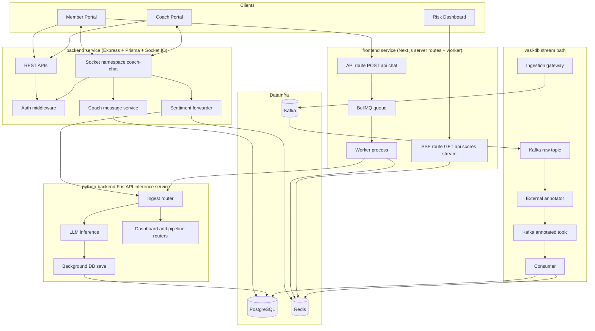
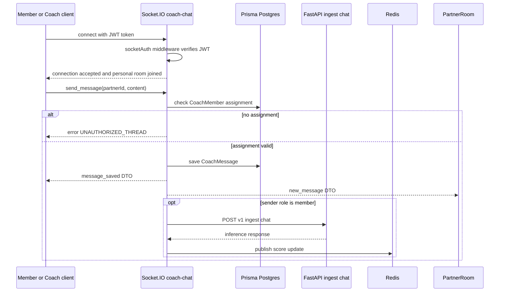
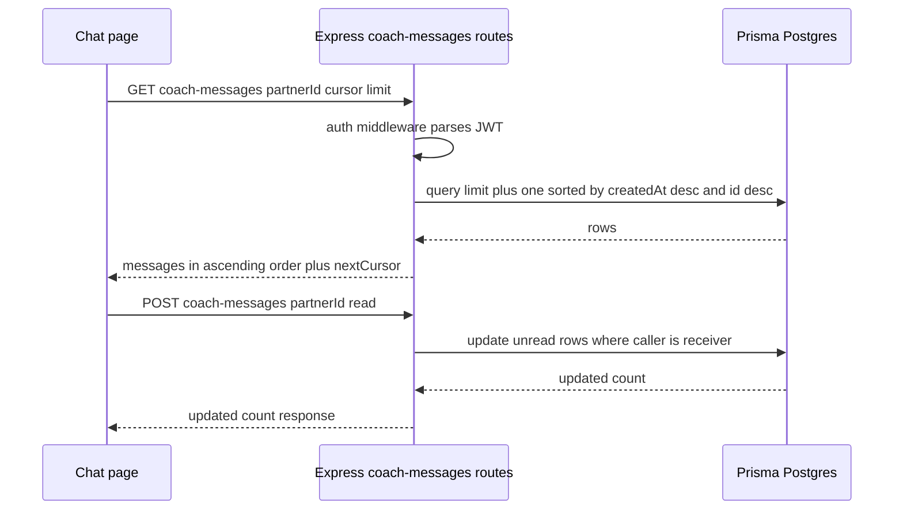
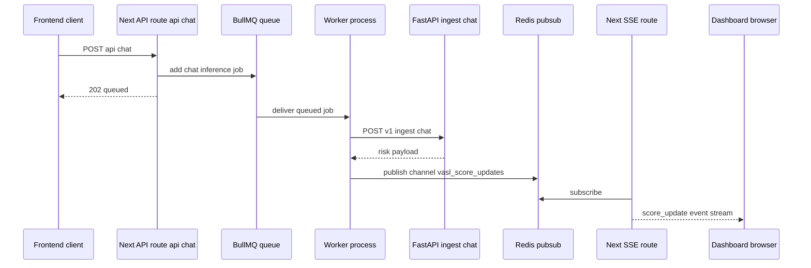
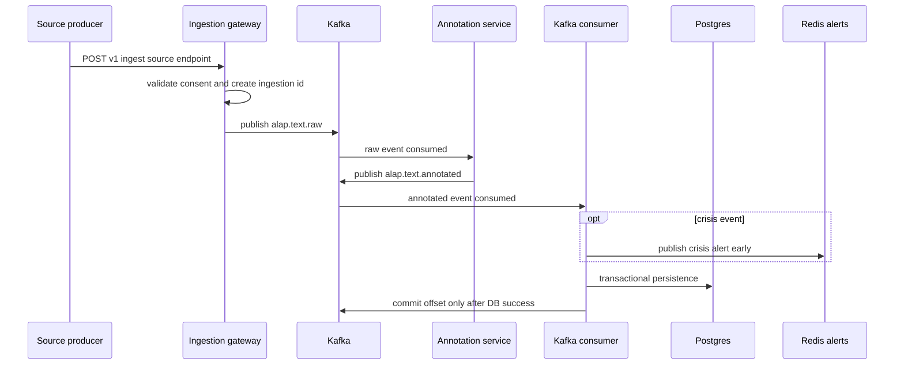

# AI-LAP Technical Documentation (Revalidated)

This document is a full-project technical reference based on:
- `.kiro/specs/persistent-coaching-chat/*`
- `.kiro/specs/coach-seeding-and-chat-assignment/*`
- current implementation in `backend`, `frontend`, `python-backend`, and `python-backend/vasl-db`

---

## 1) Complete System Architecture

### 1.1 High-level architecture

### 1.2 Backend data model (Prisma)

Core models:
- `User`
- `Coach`
- `CoachMember` (unique pair assignment)
- `CoachMessage` (persistent member-coach chat)
- `Message` (legacy direct user message path)
- `EmailVerification`
- `CommunityGroup`

Important constraints:
- `CoachMember @@unique([coachId, userId])`
- `CoachMessage` indexed for thread and unread queries:
  - `@@index([userId, coachId, createdAt])`
  - `@@index([coachId, read])`
  - `@@index([userId, read])`

---

## 2) Sequence Diagrams

### 2.1 WebSocket chat flow (member/coach messaging)

### 2.2 REST thread history + read receipt flow

### 2.3 BullMQ flow (frontend queue path)

### 2.4 Kafka ingestion flow (vasl-db path)

---

## 3) API Documentation

## 3.1 Express backend APIs (`backend`)

### Auth (`/api/auth`)
- `POST /register` - member signup, stores unverified user, sends OTP email
- `POST /verify-otp` - verifies OTP, marks user verified, returns JWT
- `POST /resend-otp` - invalidates old OTP and sends new OTP
- `POST /login` - member login, blocks unverified users
- `POST /forgot-password` - stub response

### Coach (`/api/coach`)
- `POST /register` - create coach account
- `POST /login` - coach login, returns JWT with role `coach`
- `GET /list` - public active coach directory
- `POST /assign` - authenticated member assigns self to coach
- `GET /members` - coach-only assigned member list

### Coach messages (`/api/coach-messages`, authenticated)
- `GET /` - list conversation summaries
- `GET /:partnerId` - paginated thread history via cursor
- `POST /:partnerId/read` - mark incoming messages as read

### Legacy messages (`/api/messages`, authenticated)
- `GET /conversations`
- `GET /:userId`
- `POST /`
- `PUT /:userId/read`

### Groups (`/api/groups`, authenticated)
- `GET /`
- `GET /:id`
- `POST /:id/join`
- `POST /:id/leave`
- `POST /` (controller checks `admin` or `coach`)

## 3.2 WebSocket API (`/coach-chat`)

Client to server:
- `join_thread({ partnerId })`
- `send_message({ partnerId, content })`
- `mark_read({ partnerId })`

Server to client:
- `message_saved(CoachMessageDTO)`
- `new_message(CoachMessageDTO)`
- `read_receipt({ partnerId, readAt })`
- `error({ code, message })`

Observed error codes:
- `UNAUTHORIZED_THREAD`
- `VALIDATION_ERROR`
- `SAVE_FAILED`

## 3.3 Next.js server APIs (`frontend/src/app/api`)

- `POST /api/chat`
  - validates payload
  - enqueues BullMQ job in `vasl_chat_inference`
  - returns `202` with event and job id

- `GET /api/scores/stream`
  - opens SSE stream
  - subscribes Redis channel `vasl_score_updates`
  - forwards events as `score_update`

## 3.4 FastAPI APIs (`python-backend`)

Mounted routers:
- `ingest`
- `store`
- `dashboard`
- `request_logs`
- `pipeline`

Primary ingest endpoints:
- `POST /v1/ingest/peer-post`
- `POST /v1/ingest/journal`
- `POST /v1/ingest/chat`
- `POST /v1/ingest/assessment`

Behavior:
- consent check first
- LLM inference in request path
- DB write in background task

## 3.5 Kafka ingestion APIs (`python-backend/vasl-db/ingestion`)

Endpoints:
- `POST /v1/ingest/peer-post`
- `POST /v1/ingest/journal`
- `POST /v1/ingest/chat`
- `POST /v1/ingest/assessment`

Behavior:
- consent gate
- publish to Kafka topic `alap.text.raw`
- return `202` only after broker acknowledge path succeeds

---

## 4) Kafka Workflow (Detailed)

Kafka exists in the `vasl-db` pipeline and is independent from the direct FastAPI path.

Step-by-step:
1. Ingestion gateway receives typed payload and validates consent.
2. Gateway generates `ingestion_id` and publishes to `alap.text.raw`.
3. Message key uses `member_token` to preserve per-member ordering by partition.
4. Annotation service consumes raw events and emits enriched events to `alap.text.annotated`.
5. Consumer reads annotated topic.
6. Crisis events are pushed to Redis alert channel before DB write.
7. Consumer writes to Postgres in one transaction:
   - member upsert
   - inference event insert
   - signals insert
   - SHAP attributions insert
   - snapshot upsert
8. Offset is committed only after successful persistence.

Reliability and semantics:
- delivery model: at-least-once
- idempotency: duplicate `event_id` handled with conflict-ignore strategy
- malformed JSON: logged and committed (not retried)
- processing failure: rollback + no offset commit for redelivery

---

## 5) Redis Usage (Detailed)

Redis roles across the project:

1. **Pub/Sub for risk updates**
- channel: `vasl_score_updates`
- publishers: `backend` sentiment forwarder and `frontend` worker
- subscribers: Next.js SSE route and dashboard clients via SSE

2. **SSE bridge transport**
- SSE route creates dedicated duplicate subscriber per client connection
- heartbeat keeps stream alive
- graceful unsubscribe on client disconnect

3. **Timing telemetry cache**
- key pattern: `vasl:timing:{event_id}`
- writer: worker and FastAPI ingest pipeline stages
- TTL: 600 seconds

4. **Crisis alert fanout (Kafka consumer path)**
- consumer publishes crisis alerts before DB completion for latency goals

---

## 6) WebSocket Flow (Detailed)

Connection and authorization:
1. Client sends JWT in `socket.handshake.auth.token`.
2. `socketAuthMiddleware` verifies token with `JWT_SECRET`.
3. Verified user info stored in `socket.data.user`.
4. Socket joins personal room:
   - member room `user:{id}`
   - coach room `coach:{id}`

Message send lifecycle:
1. sender emits `send_message`.
2. server resolves thread ids depending on sender role.
3. assignment guard checks `CoachMember`.
4. invalid assignment returns `UNAUTHORIZED_THREAD`.
5. valid assignment persists `CoachMessage`.
6. sender receives `message_saved`.
7. partner room receives `new_message`.
8. member-originated message triggers sentiment forwarding.

Read receipts:
- `mark_read` updates unread rows where reader is receiver
- emits `read_receipt` to partner room

---

## 7) BullMQ Processing (Detailed)

Implementation split:
- producer API route: `frontend/src/app/api/chat/route.ts`
- queue factory: `frontend/src/lib/vasl/queue.ts`
- worker runtime: `frontend/worker.mjs`

Queue behavior:
- job name: `chat-inference`
- retries: 3 attempts
- backoff: exponential, 2000ms seed
- concurrency: 20 worker jobs

Worker pipeline:
1. dequeue and compute queue wait time
2. call FastAPI `POST /v1/ingest/chat`
3. parse response and collect timing metrics
4. publish score update payload to Redis
5. asynchronously trigger pipeline flush endpoint

Operational outcome:
- UI gets immediate `202 queued`
- heavy inference work shifts off request thread
- dashboard updates stream asynchronously through Redis plus SSE

---

## 8) Auth Flow (Detailed)

### Member auth
1. `register` creates unverified member with hashed password.
2. OTP generated, hashed, persisted with expiry.
3. OTP emailed to user.
4. `verify-otp` validates newest unused unexpired OTP.
5. verification and OTP consume happen in one DB transaction.
6. JWT issued with payload `{ id, role }`.
7. `login` requires verified account and valid password.

### Coach auth
1. `coach/register` creates coach account.
2. `coach/login` validates credentials and active status.
3. returns JWT with `role: coach`.

### Middleware layers
- HTTP: `authMiddleware` parses Bearer token and sets `req.user`.
- HTTP role guard: `requireRole(...)`.
- Socket: `socketAuthMiddleware` enforces same JWT secret.

---

## 9) Project Coverage Matrix

Covered by this document:
- backend HTTP architecture
- backend Socket.IO architecture
- backend auth and role security
- backend persistent chat model and pagination logic
- frontend queue and streaming architecture
- frontend SSE bridge over Redis
- python FastAPI ingest and persistence behavior
- vasl-db Kafka ingestion and consumer path
- cross-system Redis usage
- cross-system async flow and reliability semantics

---

## 10) Spec vs Implementation Notes

1. `.kiro` defines 5-second sentiment timeout; implementation currently uses 15 seconds in `sentimentForwarder` due observed timeouts.
2. Repository contains two valid ingestion patterns:
   - direct FastAPI path (`python-backend`)
   - Kafka stream path (`python-backend/vasl-db`)
3. Both are active in repository artifacts, so both are documented.

---

## 11) Environment Variables

### backend
- `PORT`
- `DATABASE_URL`
- `JWT_SECRET`
- `FRONTEND_URL`
- `PYTHON_BACKEND_URL`
- `PYTHON_ORG_ID`
- `REDIS_URL`

### frontend and worker
- `REDIS_URL`
- `FASTAPI_URL`
- `NEXT_PUBLIC_API_URL`
- `ORG_ID`

### python-backend
- `DATABASE_URL`
- `OPENROUTER_API_KEY`
- `OPENROUTER_MODEL`
- `REDIS_URL`
- `CACHE_TTL`

### vasl-db ingestion and consumer
- `KAFKA_BOOTSTRAP_SERVERS`
- `KAFKA_TOPIC_RAW`
- `KAFKA_TOPIC_ANNOTATED`
- `KAFKA_CONSUMER_GROUP`
- `KAFKA_SSL_CA_LOCATION`
- database connection variables
