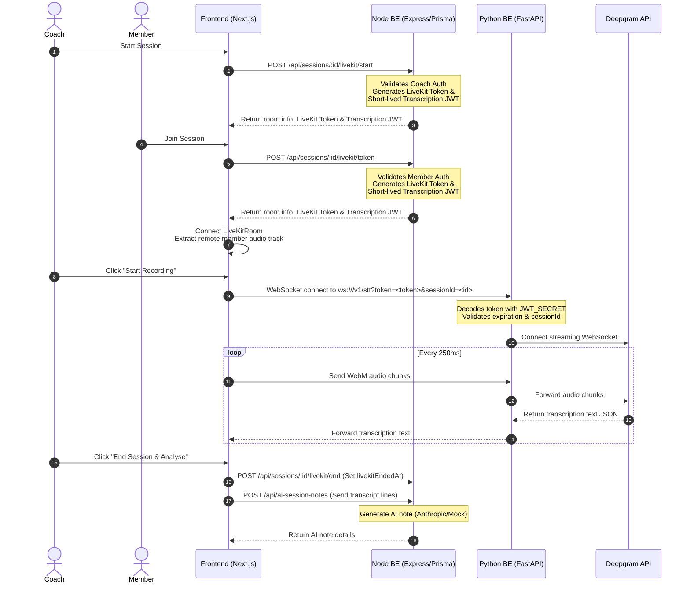

# Short-Term Transcription Security and Session Lifecycle Management

This plan establishes a secure authentication flow for the Python STT WebSocket proxy and implements proper lifecycle management for LiveKit sessions (updating `livekitEndedAt`).

## User Review Required

> [!IMPORTANT]
> - **Shared JWT Secret**: Both Node.js (product backend) and Python (analytics backend) must share the same `JWT_SECRET` value. The Python backend `.env` will need to be configured with the same `JWT_SECRET` as the Node backend.
> - **Python Dependencies**: We need to add `pyjwt` to the Python backend's `requirements.txt` to verify and decode the token.

## Open Questions

- *Do we want the `livekitEndedAt` timestamp set automatically when the AI note is saved, or should we expose a dedicated endpoint (`POST /api/sessions/:id/livekit/end`) that the coach calls when explicitly ending the call?*
  - **Proposed Approach**: We will do both. A dedicated endpoint will be added to explicitly mark the call as ended, and a fallback check will exist in the AI note creation controller to set `livekitEndedAt` if not already set.

---

## Mapped Flow: Call Start → Transcription → AI Note



---

## Proposed Changes

### 1. Product Backend (Node/Prisma)

#### [MODIFY] [livekit.controller.ts](file:///c:/Users/Ishita Bhojani/AI-LAP/frontend/BE/src/controllers/livekit.controller.ts)
- Generate a short-lived `transcriptionToken` signed with `JWT_SECRET` in `startVideoSession` and `getVideoToken`.
  - Token payload: `{ sessionId: string, userId: string, role: string, purpose: 'transcription' }`
  - Token expiry: 15 minutes (or session duration + 15m).
- Implement `endVideoSession` controller function to set `livekitEndedAt = new Date()` on the session model.

#### [MODIFY] [session.routes.ts](file:///c:/Users/Ishita Bhojani/AI-LAP/frontend/BE/src/routes/session.routes.ts)
- Add router path: `POST /api/sessions/:id/livekit/end` mapped to `endVideoSession`.

#### [MODIFY] [aiSessionNote.controller.ts](file:///c:/Users/Ishita Bhojani/AI-LAP/frontend/BE/src/controllers/aiSessionNote.controller.ts)
- Update `createAiSessionNote` to verify/set `livekitEndedAt = new Date()` if it is not already set on the corresponding `Session` record.

---

### 2. Analytics/STT Backend (Python)

#### [MODIFY] [requirements.txt](file:///c:/Users/Ishita Bhojani/AI-LAP/backend/requirements.txt)
- Add `pyjwt==2.8.0` to manage JWT decoding.

#### [MODIFY] [router_stt.py](file:///c:/Users/Ishita Bhojani/AI-LAP/backend/app/api/v1/router_stt.py)
- Load `JWT_SECRET` from environment variables.
- Update `websocket_endpoint` to extract query parameters `token` and `sessionId`.
- Validate the token:
  - Check signature and expiration.
  - Assert that `sessionId` in token matches the connection parameter `sessionId`.
  - Assert `purpose` is `'transcription'`.
- If invalid, close connection with a `1008` (Policy Violation) status code.

---

### 3. Frontend (Next.js)

#### [MODIFY] [livekit.ts](file:///c:/Users/Ishita Bhojani/AI-LAP/frontend/FE/src/types/livekit.ts)
- Update typescript types to include `transcriptionToken?: string` in `LiveKitTokenResponse`.

#### [MODIFY] [livekit.service.ts](file:///c:/Users/Ishita Bhojani/AI-LAP/frontend/FE/src/services/livekit.service.ts)
- Expose `endSession: async (sessionId: string)` calling `POST /api/sessions/:id/livekit/end`.

#### [MODIFY] [useLiveTranscription.ts](file:///c:/Users/Ishita Bhojani/AI-LAP/frontend/FE/src/hooks/useLiveTranscription.ts)
- Accept `sessionId: string` and `transcriptionToken?: string`.
- Update the WS connection URL to include query string parameters: `?token=${transcriptionToken}&sessionId=${sessionId}`.

#### [MODIFY] [LiveSessionTranscript.tsx](file:///c:/Users/Ishita Bhojani/AI-LAP/frontend/FE/src/components/session/LiveSessionTranscript.tsx)
- Accept `transcriptionToken?: string` as a prop.
- Pass `sessionId` and `transcriptionToken` into both `useLiveTranscription` invocations.

#### [MODIFY] [MeetingModal.tsx](file:///c:/Users/Ishita Bhojani/AI-LAP/frontend/FE/src/components/session/MeetingModal.tsx)
- Extract `transcriptionToken` from the returned `tokenDetails` response.
- Pass `transcriptionToken` to `<LiveSessionTranscript />`.
- In `handleSessionEndAndAnalyze`, call the newly exposed endpoint to end the LiveKit session (`LiveKitApiService.endSession`).

---

## Verification Plan

### Automated Tests
- Run backend unit tests to ensure no regressions:
  ```powershell
  cd frontend/BE
  npm test
  ```
- Run Python backend health checks or mock script to verify WS connection rejection behavior on invalid tokens.

### Manual Verification
1. Start video session call as Coach (fetches LiveKit credentials and short-lived token).
2. Start recording transcript. Verify that WebSocket connects and receives STT lines.
3. Attempt to connect to `ws://localhost:8001/v1/stt` without a token or with an invalid token/sessionId. Verify that connection is rejected.
4. End session and verify `livekitEndedAt` is populated in the database.
